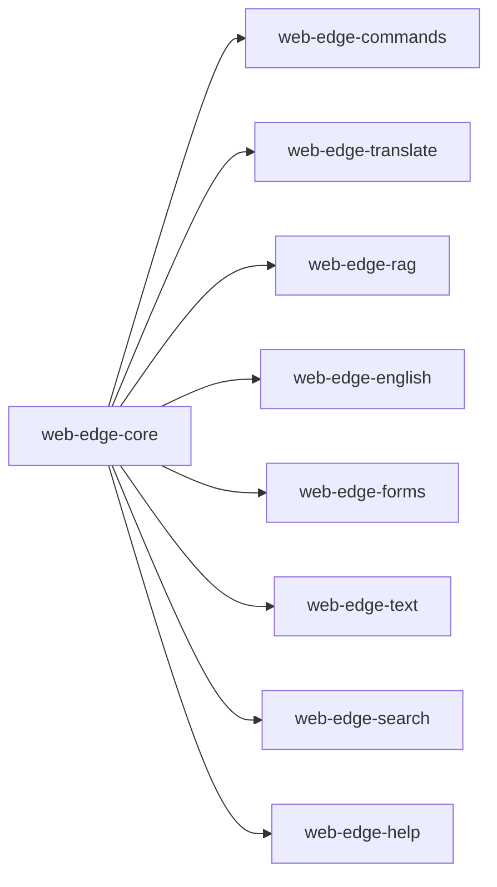

# Architecture

## Dependency Structure

Github Organization: optimaxer_ai

Git repositories (npm libraries) and dependencies:



### web-edge-core

Handles core functionality such as loading models, running inference in web workers, and managing resources.

``` javascript
import { Optimaxer } from 'web-edge-core';

const model = await Optimaxer.loadModel({ model: 'gemma-2b' });

```

### web-edge-commands

Provides a command-line interface web applications to execute simple natural language commands. The library can understand the commands like 'open Order 1234', 'show me the latest news', 'create a new task', etc. and execute the corresponding actions by navigating the web routes to load the required pages or perform the necessary operations.

``` javascript
import { CommandRunner } from 'web-edge-commands';

const runner = new CommandRunner();
runner.configure({
    [
        { entity: 'Order', action: 'view', route: (orderId) => `order/${orderId}` },
        { entity: 'Order', action: 'create', route: 'order/new' },
        { entity: 'Order', action: 'update', route: (orderId) => `order/${orderId}/edit` },
        { entity: 'Order', action: 'delete', route: (orderId) => `order/${orderId}/delete` },
        { entity: 'User', action: 'view', route: (userId) => `user/${userId}` },
        { entity: 'User', action: 'create', route: 'user/new' },
        { entity: 'User', action: 'update', route: (userId) => `user/${userId}/edit` },
        { entity: 'User', action: 'delete', route: (userId) => `user/${userId}/delete` },
        { entity: 'News', action: 'view', route: 'news' },
        { entity: 'News', action: 'create', route: 'news/new' },
        { entity: 'News', action: 'update', route: (newsId) => `news/${newsId}/edit` },
        { entity: 'News', action: 'delete', route: (newsId) => `news/${newsId}/delete` },
    ]
});


runner.runCommand('show me Order 1234')
    .then((result) => {
        // Handle success
        console.log(result);
    })
    .catch((error) => {
        // Handle failure
        console.error(error);
    });
```

### web-edge-translate

Provides translation services for web applications. The library can do language detection, translate text from one language to another in real-time, enabling users to interact with content in their preferred language.

### web-edge-rag

Provides retrieval-augmented generation (RAG) capabilities for web applications. The library can generate text based on a given prompt and retrieve relevant information from a large document to enhance the generated content.

### web-edge-english

Provides English language processing capabilities for web applications. The library can perform tasks such as grammar and spelling checks to enhance the quality of text inputs and outputs.

### web-edge-forms

Provides form processing capabilities for web applications. The library can auto fill a form by extracting information from a given text, advanced validation of form inputs, suggest corrections, and provide real-time feedback to users to improve the quality of form submissions.

### web-edge-text

Provides text processing capabilities for web applications. The library can perform tasks such as content generation, information extraction, rephrasing, auto complete, summarization, sentiment analysis, and more to enhance the user experience and provide valuable insights from text inputs.

### web-edge-search

Provides search capabilities for web applications. The library can understand natural language queries, formulate a advanced search query without users manually navigating through advanced search fields.

### web-edge-help

Provides contextual help capabilities for web applications. The library can provide real-time assistance based on the current user actions/inputs, offering tips or additional information related to possible next actions, enhancing the user experience and reducing the need for manual learning.
